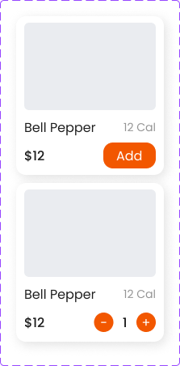

## Ordering App: 

Introducing Ordering App, a dynamic Flutter-based Application that secures user’s diet/calories based on modern calculation of specific features.  

## Getting Started

This project is a starting point for a Flutter application.

Before you begin, make sure you have the following installed on your system:

Flutter SDK: Install Flutter by following the instructions on the official Flutter website.

Dart SDK: Flutter requires the Dart SDK. You can get it as part of the Flutter installation.

Flutter IDE: Choose an IDE for Flutter development. Popular choices include Visual Studio Code with the Flutter and Dart plugins or Android Studio with the Flutter plugin.

# Features:
1. Performance Optimization using Flutterflow
2. Characteristic Integrity
3. Visually appealing Designs
4. Convenient and Seam-less Interface

## Images 

a. Primary Button: 

b. Food Card:

   
c. Food Card 1:

